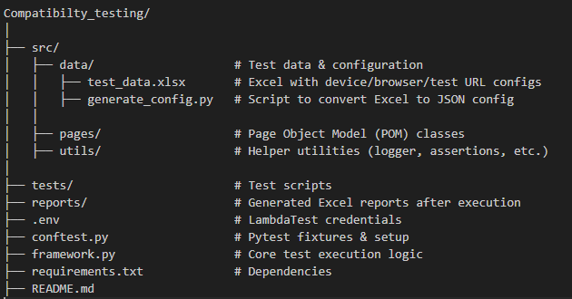
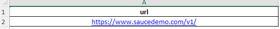
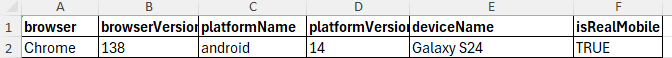
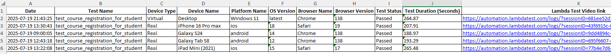
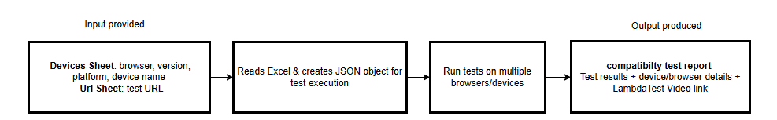

# LambdaTest Compatibility and Cross-Browser Testing Framework

## Overview
This project is a Selenium-based Python automation framework designed for cross-browser and cross-device testing using the LambdaTest platform. 

It enables the execution of test scripts across a wide range of real and virtual devices.The framework follows Page Object Model (POM) design pattern, promoting reusability, maintainability.

## Key Features
- **Excel-Driven Configurations**
  - The framework extracts test environment details such as browser, platform, device name and test URL from a structured Excel file without modifying code.
- **Cross-Browser & Cross-Device Execution**
  - Allows Cross-browser and cross-device testing on LambdaTest and Supports both real and virtual devices
- **Automated Reporting**
  - Automatically generates an Excel report with Device/browser/OS info,Test execution status and LambdaTest video session link

## Project Structure

## Prerequisites
### Create a LambdaTest Account & Get Credentials
-	**Sign Up**: Go to LambdaTest [Sign Up](https://accounts.lambdatest.com/dashboard) and create a free account.
- 💡 Note: Plan Selection: For real device testing, ensure your plan includes: Web Automation Testing → Web & Mobile Browser on Real Device
- Get Your Credentials: Once logged in, open the side menu in the Dashboard.
- Copy your Username and Access Key from the Credentials section to connect your tests to LambdaTest.

## Installation
1. **Clone the repository**

<pre>
git clone https://github.com/srujanaa6/Compatibilty-testing.git
cd Compatibilty-testing
</pre>

2. **Install dependencies**

<pre> pip install -r requirements.txt </pre>

3. **Set up LambdaTest credentials in project**

Create a `.env` file in the root directory:
<pre>LT_USERNAME= your_lambdatest_username
LT_ACCESS_KEY= your_lambdatest_access_key
</pre>

## Set up virtual environment (recommended)

### Windows (PowerShell)
<pre>
python -m venv .venv
.venv\Scripts\Activate.ps1
</pre>

### Windows (Command Prompt)
<pre>
python -m venv .venv
.venv\Scripts\activate.bat
</pre>

### macOS / Linux
<pre>
python3 -m venv .venv
source .venv/bin/activate
</pre>

## Test Data Configuration
The file `./src/data/test_data.xlsx` contains all configuration data for your test environment:

**Devices Sheet**: Defines cross-browser/device parameters:
browser, browserVersion, platform, platformVersion, deviceName, etc.

💡 Note: Use the provided template.You may add new devices, but ensure column names remain unchanged.

💡 Note: To check which devices support which platform versions:
 use the [LambdaTest Capabilities Generator](https://www.lambdatest.com/capabilities-generator/).

**Example**:

**Url Sheet**: Stores the test URL for running tests.

**Example**:

## Load Test Configurations
Run the following script to generate the test configuration JSON from `.\src\data\test_data.xlsx`:

<pre>python .\src\data\generate_config.py</pre>

Example of generated Test configuration JSON object from excel file `./src/data/test_data.xlsx` :

**JSON Object:**
<pre>
  {
    "browser": "Chrome",
    "browserVersion": "138",
    "platformName": "android",
    "platformVersion": "14",
    "deviceName": "Galaxy S24 ",
    "isRealMobile": "False"
  }
</pre>

### Test Setup Fixtures

The **conftest.py** file contains reusable pytest fixtures for test setup.
- **dataLoad**: Loads test data (username, access key, URL) from .env and Excel.
- **driver**: Creates and configures a Selenium WebDriver session on LambdaTest.
- **setup**: Returns pre-initialized `LoginPage`, `Utils` to use in tests.

**Example usage in a test:**
<pre>
def test_login(setup):
    login_page, assertion, url = setup
    login_page.navigate_to_page(url)
    login_page.login()
    assertion.assert_page_is_displayed(login_page.products_catalog_page, "Products Catalog Page")
</pre>

## Running Tests
Run a test using pytest:
<pre> pytest .\tests\your_test_file.py -v -s </pre>

### The framework will:
- Execute the test across all environments defined in the Excel file.
- Automatically generates a `compatibility_test_report` in reports/ folder in Excel format with:
  - Device, Browser,Platform details
  - Pass/Fail status
  - LambdaTest session video link

Example of `./reports/compatibility_test_report.xlsx`:

<pre>
💡 Note: Every execution appends Test Results to compatibility_test_report
</pre>

## Workflow

