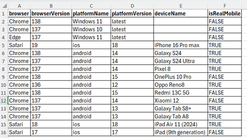

# LambdaTest Compatibility and Cross-Browser Testing Framework

## Overview
This project is a Selenium-based Python automation framework designed for cross-browser and cross-device testing using the LambdaTest platform. It enables the execution of test scripts across a wide range of real and virtual devices.The framework follows Page Object Model (POM) design pattern, promoting reusability, maintainability.

## Main Features
- Reads test configurations from Excel
  - The framework extracts test environment details such as browser, platform, device name and test URL from a structured Excel file without modifying code.
- Allows Cross-browser and cross-device testing on LambdaTest and Supports both real and virtual devices
- Automatically generates an Excel report with Device/browser/OS info,Test execution status and LambdaTest video session link

## Project Structure

Compatibilty_testing/
│
├── src/
│   ├── data/                    # Test data & configuration
│   │   ├── test_data.xlsx       # Excel with device/browser/test URL configs
│   │   ├── generate_config.py   # Script to convert Excel to JSON config
│   │
│   ├── pages/                   # Page Object Model (POM) classes
│   ├── utils/                   # Helper utilities (logger, assertions, etc.)
│
├── tests/                       # Test scripts
├── reports/                     # Generated Excel reports after execution
├── .env                         # LambdaTest credentials 
├── conftest.py                  # Pytest fixtures & setup
├── framework.py                 # Core test execution logic
├── requirements.txt             # Dependencies
├── README.md

## Pre-requisites
### Create a LambdaTest Account & Get Credentials
-	Sign Up: Go to LambdaTest [Sign Up](https://accounts.lambdatest.com/dashboard) and create a free account.
- 💡 Note: Plan Selection: For real device testing, ensure your plan includes: Web Automation Testing → Web & Mobile Browser on Real Device
- Get Your Credentials: Once logged in, open the side menu in the Dashboard.
- Copy your Username and Access Key from the Credentials section to connect your tests to LambdaTest.

## Installation
1. Clone the repository
<pre>
git clone https://github.com/srujanaa6/Compatibilty-testing.git
cd project_name
</pre>

2. Install dependencies
<pre> pip install -r requirements.txt </pre>

3. Set up LambdaTest credentials in project
Create a .env file in the root directory:
<pre>LT_USERNAME= your_lambdatest_username
LT_ACCESS_KEY= your_lambdatest_access_key
</pre>

## Test Data Configuration
The file **./src/data/test_data.xlsx** contains all configuration data for your test environment:
- **Devices Sheet**: Defines cross-browser/device parameters:
browser, browserVersion, platform, platformVersion, deviceName, etc.
- **Credentials Sheet**: Stores the test URL and related credentials for running tests.
💡 Note: To check which devices support which platform versions, use the LambdaTest Capabilities Generator  https://www.lambdatest.com/capabilities-generator/.

### How to Set Up Test data
- The framework reads each row from the Devices Sheet.
- Execute the test across all environments defined in the sheet.
**Example**:

### Load Test Configurations
Run the following script to generate the test configuration JSON from .\src\data\test_data.xlsx:
<pre> python .\src\data\generate_config.py </pre>

Eaxmple of generated Test configuration JSON object:
<pre>
        {
            "browser": "Chrome",
            "browserVersion": "138",
            "platformName": "android",
            "platformVersion": "14",
            "deviceName": "Galaxy S24 ",
            "isRealMobile": "False"
        }
</pre>

## Running Tests
Run a test using pytest:
<pre> pytest .\tests\your_test_file.py -v -s </pre>

### The framework will:
- Execute the test across all environments defined in the Excel file.
- Automatically generates a *compatibility_test_report* in reports folder in Excel format after execution.

